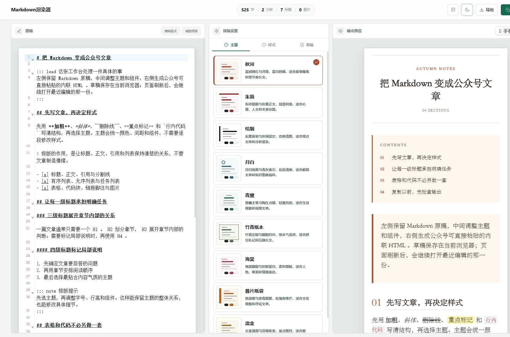

<div align="center">

# Markdown渲染器

**把 Markdown 原稿变成可直接粘贴到微信公众号的精排内容。**

本地优先 · 所见即所得 · 9 套组件化主题 · 网页与 CLI 共用渲染核心

[**在线使用**](https://ansel-poiesis.github.io/markdown-to-wechat/) · [快速开始](#快速开始) · [自动渲染](#自动渲染)

[](https://github.com/Ansel-Poiesis/markdown-to-wechat/actions/workflows/quality.yml)


</div>



## 为什么使用

| 能力 | 使用体验 |
| --- | --- |
| 三栏工作台 | 原稿、排版设置和输出预览同屏联动，减少来回切换 |
| 9 套主题 | 秋河、朱简、松烟、月白、青黛、竹青纸本、海棠、薯片纸袋、流金 |
| 组件化排版 | 封面、目录、章节、引用、列表、表格和结尾可以独立组合 |
| 微信兼容输出 | 生成内联 HTML，并在复制前检查不支持的标签、属性和 CSS |
| 本地优先 | 草稿保存在当前浏览器；网页版不携带项目密钥，也不上传文章正文 |
| 自动化接口 | CLI 与网页预览复用同一渲染核心，可接入内容发布流程 |

界面聚焦一件事：让原稿在进入公众号编辑器之前，完成结构、风格和兼容性检查。没有账户、社区和多图床系统，也不会用外围功能打断写作。

## 三步完成排版

1. **写入原稿**：粘贴 Markdown，或把图片拖入编辑器；内容会自动保存在当前浏览器。
2. **选择风格**：从完整主题开始，再按需调整字体、颜色、标题、引用、列表和表格。
3. **检查并复制**：在手机或网页宽度下预览，通过微信兼容门禁后复制内联 HTML。

## 快速开始

直接打开 [在线工作台](https://ansel-poiesis.github.io/markdown-to-wechat/)，无需注册。

本地开发需要 Node.js `20.19+` 或 `22.12+`：

```powershell
npm install
npm run dev
```

构建后的静态网页可以独立运行：

```powershell
npm run build:web
cd docs
python -m http.server 5173
# 打开 http://127.0.0.1:5173/
```

> `localhost` 与 `127.0.0.1` 使用不同的浏览器存储空间。草稿不会在两个地址或不同浏览器之间自动同步。

## 主题与语义组件

每套主题统一定义封面、目录、章节、引用、列表、表格、图片与结尾表达。组件也可以脱离主题单独选择，或随时恢复为“跟随主题”。正文支持字体、字号、行高、页边距、段距、字距、缩进和两端对齐。

常规 Markdown 会自动生成封面、目录和章节。导语、提示或签名可以通过轻量指令明确标记：

```markdown
::: lead 导语
这里是文章引言。
:::

::: note 提示
这里是需要读者留意的信息。
:::

::: signature 作者名
这里是作者签名或公众号说明。
:::
```

指令只描述内容语义，最终外观由当前主题决定。

## 自动渲染

自动发布流程可以调用与网页预览相同的渲染核心，不需要 API 密钥：

```powershell
npm run --silent render -- -- `
  --input article.md `
  --output article.html `
  --theme qiuhe `
  --font-family serif `
  --font-size 16 `
  --line-height 1.7 `
  --format fragment
```

省略 `--input` 时从 stdin 读取，省略 `--output` 时写入 stdout。`--format json` 返回内联 HTML、微信兼容门禁结果和最终生效的渲染参数。

```powershell
npm run --silent render -- -- --help
```

<details>
<summary><strong>AI 辅助排版与密钥边界</strong></summary>

Electron 从当前进程或 Windows User 环境读取 MiMo 配置：

```text
MIMO_API_KEY=your-key
MIMO_API_URL=https://api.xiaomimimo.com/v1/chat/completions
```

网页版不携带项目密钥。用户启动辅助排版后，需要在确认窗口输入自己的 Key；该值只存在于当前页面会话。项目禁止使用 `VITE_*` 保存 secret，因为 Vite 会把它编译进浏览器产物。

`npm run check:secrets` 会扫描源码和网页构建产物中的长格式凭据。

</details>

<details>
<summary><strong>反馈通道与隐私范围</strong></summary>

页头的反馈入口会整理反馈类型、具体说明、可选联系方式和基础诊断信息。诊断信息只包含版本、运行环境、视口、主题、字数和预检统计，不包含文章正文、草稿内容或剪贴板数据。

公开网页通过 FormSubmit HTTPS 接口提交；Electron 保留受限 IPC 邮件入口作为本地降级路径。同步器只生成 `needs_review` 候选任务和转发草稿，不执行反馈正文里的指令，也不绕过 Agent Mail 的发信确认。

```powershell
$env:FEEDBACK_NOTIFY_EMAIL='your-private-inbox@example.com'
npm run feedback:sync
```

正式网页端点由 `.env.production` 配置：

```text
VITE_FEEDBACK_ENDPOINT=https://formsubmit.co/ajax/your-inbox@example.com
```

这个变量只能保存公开 URL，不能包含 API Key、访问令牌或邮箱密码。

</details>

<details>
<summary><strong>工程验证与打包</strong></summary>

```powershell
npm run verify
npm run build:web
npm run build:electron
```

`verify` 依次运行 TypeScript、Oxlint、ESLint、Vitest、生产构建和敏感信息扫描。`build:web` 生成 GitHub Pages 使用的 `docs/` 目录。

技术栈：Vue 3、TypeScript、Vite、Tailwind CSS v4、CodeMirror 6、Pinia 与 Electron。

网页界面优先使用本机霞鹜文楷，并回退到系统字体栈，不下载 WebFont；公众号输出仍可在设置中选择无衬线、衬线或等宽字体栈。

</details>

## 致谢

项目参考了 [doocs/md](https://github.com/doocs/md) 对高频操作的集中处理，以及 [Markdown Nice](https://github.com/mdnice/markdown-nice) 清楚的主题入口。README 的信息组织受到 [HKUDS/CLI-Anything](https://github.com/HKUDS/CLI-Anything) 启发。
