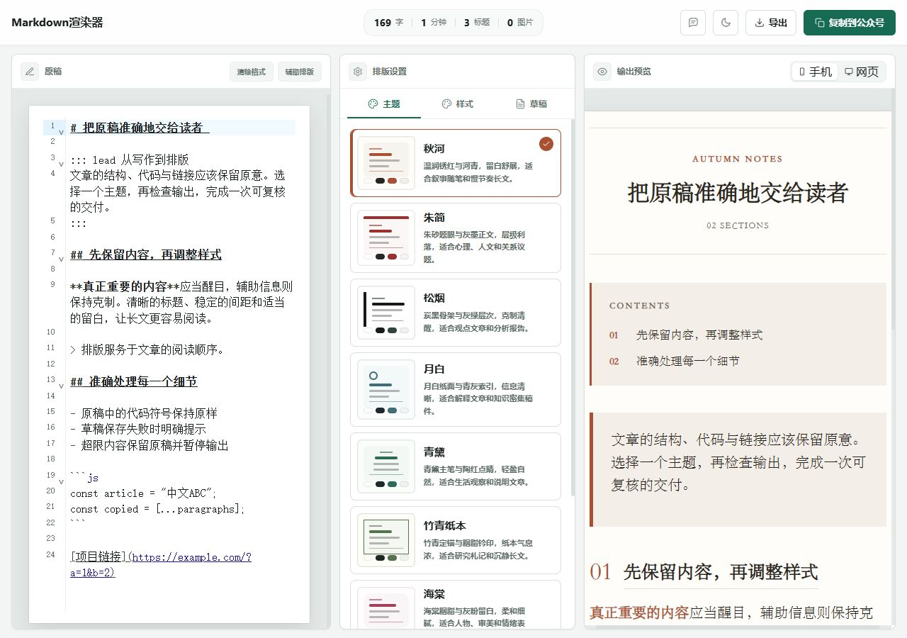
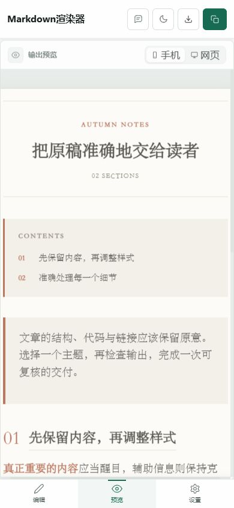

# Markdown 渲染器：工程评估与优化计划

日期：2026-09-27。任务：Player Todo `TASK-14.1`。源码：`C:\Ansel_Work\10_Projects\20_ContentTools\markdown-to-wechat`。审计基线：`main@1182575`；本轮分支：`codex/audit-20260927`。

## 判断

**这是定位清楚、视觉方向一致、有工程基础的实用工具；基线尚不足以判定为高可靠成熟产品，更不能承诺实现准确无误。** 本轮证实并修复了一批原稿保真、数据恢复、安全和复杂输入问题，交付状态是本地补丁候选。正式网页与桌面仍为 2.0.1。

最有价值的基础是网页、CLI 共用渲染核心，主题与组件输出分离，纯本地草稿及清楚的付费调用边界。主要薄弱点是手写 Markdown 解析器、同步主线程工作、草稿全集存储，以及测试曾集中验证自定义 HTML 白名单，缺少错误输入、持久化故障和真实平台回归。

| 维度 | 实测判断 | 本轮结果与边界 |
| --- | --- | --- |
| 版本管理 | 关键链路可追溯，入口文档曾过时 | Git 远端/本地 main 一致；标签、Release、Pages、Products 哈希有对应证据；修正旧 docs 提交号与半年维护入口。PR #7 仍未合并，正式发布未变 |
| 工程质量 | 分层合理，有 TS/lint/CI；故障覆盖原先不足 | 基线 73 测试全过仍能复现关键缺陷；补丁后 25 文件 180 测试、完整 verify 通过。新增 Windows CI job 尚未在远端执行 |
| 实现正确性 | 常用文章语法可用；不是完整 CommonMark/GFM | 修复代码、转义、围栏、脚注、表格、列表、链接与预检不一致；复杂嵌套强调等仍需语法合同与成熟 parser |
| 安全与事务 | 多层边界原先有缺口 | 修复 CSS 门禁混淆、IPC 来源、凭据重定向、SSE 结束/限额、AI 编辑竞争、反馈字段外发与假成功；均为离线红队，未触发付费 API 或发信 |
| 压力与性能 | 普通常见长文快速；复杂度不能只按字数估计 | 22 场景：14 正常渲染、8 安全拒绝。修复 OOM、宽表格预分配和方括号退化扫描。尚未测浏览器 p95/峰值和长期编辑 |
| 前端审美 | 适合中文编辑与长文排版，值得保留 | 三栏角色、绿色主操作、主题缩略图、纸面预览关系清楚。修复平板裁切、键盘弹窗、保存状态和辅助文字对比；参数密度、小字与移动触控仍可优化 |
| 产品闭环 | 编辑→主题→预检→富文本复制/HTML 导出已本地验证 | 真正微信后台粘贴后保真、实际 Electron 安装包、iOS/Android 真机尚未验收，不能由本地 gate 代替 |

## 已落地的关键修复

1. **保留原稿。** 移除首次输入的隐式标点改写；代码符号不再变成弯引号/省略号；代码内 Markdown 保持字面量，清除格式不再删掉代码正文。
2. **减少丢稿风险。** 保存失败真实可见；损坏归档不被初始化覆盖；新增携带草稿身份/更新时间的原子恢复备份，覆盖“归档配额失败但当前稿备份成功→刷新”的恢复路径；旧存储保留迁移。
3. **复制与导出准确反馈。** 同时写入 HTML/纯文本，检查 fallback 的真实返回值，清理临时选区；失败不声称成功。浏览器实际生成 HTML 下载文件，UTF-8、代码和链接编码均核验。
4. **AI 事务与安全。** 防止响应覆盖请求期间的修改、同文本跨稿写回、重复请求与取消晚结果；限制请求、事件、输出、传输和总时间；拒绝损坏/截断流，校验主进程 IPC 来源与参数，阻断带 Key 请求重定向。
5. **渲染与资源边界。** 原子行内处理、正确围栏、合理表格/列表结构、Map 外链索引；在膨胀分配前计入预算；UI 捕获错误并保留原稿、禁复制/导出；CLI 返回失败且不输出部分 HTML。
6. **交互与视觉。** 1180px 以下使用标签工作区，修复中间宽度三栏裁切；销毁卸载的编辑器；有序插入图片、保留 PNG/WebP 编码与 GIF 原数据；三个弹窗加入焦点管理与 Escape；浅色辅助文字加深，保存状态由 10px 调整为 11px。
7. **工程门禁。** Vitest 4.1.10→4.1.11，兼容修复锁文件传递依赖；`npm audit` 从 12 告警（8 high/4 moderate）变为 0。`build:web` 增加类型检查；浏览器 smoke 强制新建 dist、处理错误/超时/非零退出；补 CLI 进程合同和 Windows CI。

完整逐项证据：[渲染核心](renderer.md)、[安全红队](security.md)、[前端与存储](frontend.md)。测试数量不能当作漏洞数量，也不能证明任意输入无缺陷。

## 版本和交付溯源

- 远端 `main=11825751a63fecc4eadd3c1ebdce83acf4124eba`；`git fsck --full` exit 0。
- `v2.0.1` 为 annotated tag，解引用到 `e07e866`；实际 `docs/` 改动提交为 `25bdac5`。
- PR #7：OPEN / CLEAN / verify SUCCESS，head `maintenance-202609@0e1ee42`。本轮从 main 分出，未擅自合并维护线。
- 主分支要求 PR 与严格 `verify`，禁止强推和删除，对管理员生效；批准 review 数为 0，因此不保证独立人工复核。
- Pages API：built / commit `1182575`；线上 HTTP 200，指纹 `index-DK6Y9cKj.js` 与 `index-BZHcZM-0.css`。
- Products web 的 8 个文件与 Git docs SHA-256 一致；两 Windows exe 与 GitHub Release digest 一致，完整哈希见 [VERSIONING.md](../../VERSIONING.md)。一致性证明对应产物身份，不证明本轮新补丁已发布。
- 包版本保留 2.0.1；没有重建/晋级桌面安装包、改写 docs 线上产物、创建 Release、合并 PR 或修改账户/调度。

## 验证证据

环境：Windows、Node 24.18.0、npm 11.16.0、Vitest 4.1.11。本机日期 2026-09-27。

| 检查 | 结果 |
| --- | --- |
| `npm run verify` | exit 0；type-check、Oxlint、ESLint、180 tests / 25 files、Vite 构建、97 text files 密钥扫描 |
| `npm audit` | 更新后 0 已知告警；这是检查时公告数据库的结果 |
| 核心基线差分 | 7 个独立缺陷样例基线 fail，补丁 pass；旧核心加载当前主题/gate 依赖，非完整旧版快照 |
| 红队 | CSS/HTML、URL/属性、IPC、邮件参数、SSE、取消/并发、隐私投影和配额/损坏存储；网络与系统调用 mock |
| 压力 | 22 个有界隔离子进程场景全部符合预期；每例15秒/384MiB heap，14输出+8拒绝；结束内存快照非峰值 |
| CLI | stdin JSON 等同核心、非法参数退出1且无stdout、中文路径 HTML 导出、超限退出且无半成品 |
| 浏览器冒烟 | 当前源码新构建，两窗口 DOM 检查 pass；Chrome 窗口大小不能当设备 CSS viewport |
| 真实 viewport | 390、768、1024、1180、1280、1536px：显示面板均在视口内，页面无横向溢出 |
| 实际交互 | 九主题切换/pressed态；代码与URL保真；实际 HTML+plain clipboard；压力错误提示及禁用输出；弹窗 ShiftTab/Escape/回焦；页面刷新恢复；HTML 实际下载并读盘验证 |

本地原始日志、下载样例与更多截图在 `browser-smoke/audit-20260927/`（忽略入 Git）。核心差分/压力 JSON 与本报告入版本管理。独立测试结果不能累加为另一个“总测试数”，最终总数以180为准。

代表性单次核心耗时：百万中文字符约91ms、5000链接约183ms、4000复杂表行约218ms；200k密集行内标记从预算前 OOM 变为约51ms明确拒绝。渲染器上限按 UTF-16 code units / token 计算，详见 [压力合同](renderer.md#压力结果与预算合同)。这不是浏览器60fps保证。

保留的构建提示：异步 CodeMirror chunk 约628KB（gzip217KB），初始主chunk约374KB（gzip124KB）；Vite仍提示大chunk。机器级 npm 的 `shamefully-hoist` 未识别配置提示未修改，因为不属于此仓库。

## 前端审美与可用性结论

实际观察：浅灰/绿工作台与暖纸色文章区能区分“工具”和“作品”，主题卡片同时展示色彩和结构，主复制按钮识别清楚。移动端转换为编辑/预览/设置三标签，比在平板硬塞三栏更可用。本轮保留这些有效选择。

原先保存状态仅10px，实际浏览器测得 `rgb(140,153,148)` 对白底约2.96:1。已把浅色 tertiary 调为 `#65736d`，最终构建浏览器确认 computed style 为 `rgb(101,115,109)` / `11px`，白底计算约4.97:1。只说明这一实测组件的改善，不声称整站通过可访问性认证；普通文字对比要求参照 [W3C SC1.4.3](https://www.w3.org/WAI/WCAG22/Understanding/contrast-minimum.html)。

后续值得优化：设置项的密度与字号、主题缩略图对真实文章的代表性、手机图标触控目标、文章封面/目录装饰占用首屏的比例。英文装饰与文楷是否适合具体稿件属于偏好判断，应使用同稿 A/B 再由先生决定，不能凭审计擅自换风格。

## 同类项目的指导意义

这是根据官方仓库/规范做的工程判断，并非功能数量排名，也未搬运这些项目的实现。

| 来源 | 可借鉴的方向 | 在本项目的落点 |
| --- | --- | --- |
| [doocs/md](https://github.com/doocs/md) | 标准语法、主题、草稿和导入导出完整路径 | 对照真实文章建立输入/输出样例；保留本地优先，不必复制账号、多图床与多模型规模 |
| [Markdown Nice](https://github.com/mdnice/markdown-nice) 与[官方示例稿](https://github.com/mdnice/markdown-nice/blob/master/src/template/content.md) | 主题设计及可直接用于微信验证的语法示例 | 把主题验收建立在同稿、同元素的微信实际呈现上 |
| [markdown-it](https://github.com/markdown-it/markdown-it) 与 [CommonMark 0.31.2](https://spec.commonmark.org/0.31.2/) | 成熟 parser、扩展接口和可运行规范样例 | 先定义本项目下划线/指令/脚注等差异合同，再替换解析层，保留主题输出层 |
| [DOMPurify](https://github.com/cure53/DOMPurify) | 浏览器理解的 HTML 安全与显式净化策略 | 审视生成层安全、预览边界与微信兼容 gate 的不同职责；不把兼容白名单当完整XSS证明 |

## 优化计划与验收顺序

以下是建议序列，实际活跃状态只维护在 Player Todo，不新增一份任务队列。

| 阶段 | 优先级 | 具体工作 | 完成判据 |
| --- | --- | --- | --- |
| 本轮补丁 | P1/P2 | 本报告中的正确性、安全、恢复、超限和响应式修复 | 已有复现与回归；完整verify、压力、浏览器证据就绪 |
| 发布验收 | P1 | 人工评审补丁；协调PR#7文档重叠；实际Electron启动/复制/下载；秋河、朱简同稿在微信后台粘贴并查PC/手机 | 记录源码commit、候选包hash、真实平台差异与截图；再由先生决定版本号/合并/发布 |
| 解析与效率 | P1 | 将常用语法合同固化成差分语料；评估markdown-it AST适配；Worker渲染、取消过期结果、编辑响应预算 | 不丢正文；既有9主题输出约定保持；新旧差分均有解释；20k/100k真实文章持续输入/切主题有p50/p95 |
| 草稿可靠性 | P2 | IndexedDB单稿记录与历史修订；多标签页冲突提示；源Markdown导入/备份导出 | 20/100/500草稿、同稿/不同稿双窗口、配额与崩溃重开有行为回归，不静默最后写入覆盖 |
| AI可信应用 | P2 | 格式前后差异预览，数字/链接/段落核对，用户选择应用 | “服务完整返回”和“语义保真通过”分开呈现，有取消/跨稿/部分返回测试 |
| 视觉与质量门禁 | P2 | 小字/触控目标与主题同稿A/B；浏览器交互回归和有界压力纳入CI | 新Windows job有远端成功回执；手机/平板/桌面及深浅模式可复验；不只检查DOM字符串 |

最关键的未完成验收是微信公众号真实粘贴。此前项目明确要求先生本人完成；本轮未登录公众号、未操作账号安全，也未将这些项目标为完成。当前工作已形成可审查补丁，尚未授权的发布/账户动作保持未执行。
